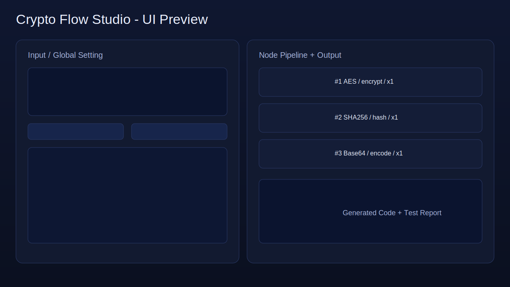

# Crypto Flow Studio

單檔 React（`index.html`）打造的加密流程工具，包含拖曳節點、多語介面、PWA、Node.js/TypeScript 程式碼匯出與設定保存。



## 功能總覽

- 多種演算法：`AES`、`DES`、`TripleDES`、`RSA`、`SHA-256`、`ECC`、`DLog` 等
- 節點流程：可新增/刪除/拖曳節點，形成 `輸入 -> 一次加密 -> 二次加密 ...`
- 匯出程式：可匯出 `Node.js JavaScript` 或 `TypeScript`
- i18n：支援 `繁體中文 / English / 日本語`
- PWA：含 `manifest.json` 與 `sw.js`，可離線載入
- RWD：手機與桌機皆可使用
- 黑白主題：提供 `black/white` 主題切換
- 配置保存：支援本機 `localStorage` 快速保存與載入
- 品質測試：內建基礎單元測試與整合測試按鈕

## 檔案結構

- `index.html`：主工具（React + 加解密流程 + 匯出器）
- `manifest.json`：PWA 應用設定
- `sw.js`：Service Worker 離線快取
- `WEBMCP.md`：WEBMCP 規格說明
- `webmcp-example.html`：WEBMCP 調用與管理示例頁
- `skill.json`：Skill 能力宣告
- `docs/overview.svg`：README 截圖示意

## 安裝與啟動

> 專案為純前端靜態檔，不需要 build。

```bash
python3 -m http.server 8000
```

開啟：`http://localhost:8000/index.html`

## 使用說明

### 1) 建立加密流程

1. 在輸入區貼上明文或密碼。
2. 按 `+ Cipher / + Hash / + Codec / + Custom / + Asymmetric` 新增節點。
3. 透過拖曳（或 `↑ ↓`）調整流程順序。
4. 設定每個節點的演算法、模式、重複次數。
5. 按 `執行流程` 查看每一步輸出與最終輸出。

### 2) 配置管理

- `export JSON / import JSON`：手動匯入匯出。
- `save local / load local`：儲存到瀏覽器本機，下次可快速載入。

### 3) 匯出 Node.js / TypeScript 程式

1. 在「匯出程式碼」區選擇格式（JS 或 TS）。
2. 點 `generate code`。
3. 可 `copy code` 或 `download file`。

### 4) 語言與主題

- 語言：右上角下拉切換 `繁中/English/日本語`
- 主題：右上角 `theme: black/white`

## 支援的加密類型

### Cipher（可逆）
- `AES`, `DES`, `TripleDES`, `Rabbit`, `RC4`, `RC4Drop`

### Hash（不可逆）
- `MD5`, `SHA1`, `SHA224`, `SHA256`, `SHA384`, `SHA512`, `SHA3`, `RIPEMD160`

### Codec / Custom
- `Base64`, `Hex`, `URL`, `Reverse`, `ROT13`, `Caesar`, `XOR`

### Asymmetric（示範）
- `RSA`, `ECC`, `DLog`

## PWA 檢查步驟

1. Chrome DevTools -> Application
2. 檢查 `Manifest` 是否載入
3. 檢查 `Service Worker` 狀態為 activated
4. 斷網重新整理，確認主頁可離線開啟

## WEBMCP 與 Skill

- `WEBMCP.md`：描述可交換的節點配置格式
- `webmcp-example.html`：提供呼叫測試與管理介面（`tools/list`、`tools/call`、多語）
- `skill.json`：宣告本工具可用能力（流程編輯、匯出、語言/主題切換等）

## 品質與測試

主頁內建測試包含：
- Caesar 可逆測試
- XOR 可逆測試
- AES 加解密測試
- Pipeline 整合測試
- 程式匯出內容檢查

## 安全提醒

- Hash 節點為不可逆，不能解密。
- `ECC/DLog` 在本專案使用「共享祕密 + XOR」教學示範，不等同完整生產級加密協議。

## 專案連結

- GitHub: https://github.com/Lian0123/password-cyrpt-deitor

## 維護建議（定期更新）

建議每 2~4 週執行一次：

1. 檢查瀏覽器相容性（Chrome / Safari / Edge / Firefox）。
2. 檢查手機/平板/桌機版面（RWD）與主題切換一致性。
3. 執行頁面內建測試（`Quality Tests`）並記錄結果。
4. 更新 `manifest.json`、`sitemap.xml`、`robots.txt` 與版本號。
5. 依使用者回饋調整節點操作流程與錯誤提示。
